<div align="center">

# TEdu ✳

### The teaching ledger shop · for devoted tutors

*A complete management ledger for a solo tutor / teacher — students, classes, timetable, attendance, tuition, printable receipts, test scores, lesson journals, a document library and an AI assistant — all packed into **a single HTML file**, dressed as a 1960s Saigon stationery shop.*

**🌐 Try it now: [tedu-app.netlify.app](https://tedu-app.netlify.app)** — click **"Xem thử bản demo"** (Try the demo), no account needed.


-33506B)


</div>

---

## Table of contents

- [Why TEdu exists](#why-tedu-exists)
- [Features](#features)
- [Screenshot gallery](#screenshot-gallery)
- [Use it in 30 seconds](#use-it-in-30-seconds)
- [Self-host your own copy](#self-host-your-own-copy)
- [Architecture & tech](#architecture--tech)
- [Security & data](#security--data)
- [Languages](#languages)
- [License](#license)

---

## Why TEdu exists

A solo tutor usually runs their classes with a paper notebook + Zalo + Excel: attendance in one place, money in another, and at the end of the month they hand-count every session before texting each parent. TEdu folds that whole routine into one page:

**Take attendance, and tuition adds itself up.** Every session you mark is billed straight into each student's monthly balance at their per-session rate. When collection day comes, open *Tuition* and every number is already there — with a printable receipt, a VietQR code pre-filled with the amount due, and ready-made parent messages.

The entire app lives in **one `index.html` file** — nothing to install, no server required; open it in a browser and it runs. Connect Firebase (optional) for Google sign-in and multi-device cloud sync.

## Features

### 👩‍🏫 Classroom
- **Students** — full profiles (school, class, subject, per-session rate, parent, phone); add/edit/delete one by one or **bulk-add in an Excel-like grid** (paste straight from Excel/Google Sheets; Tab/Enter move between cells like a spreadsheet).
- **Classes with terms** — each class has start/end dates, a weekly schedule and its own colour; expired classes move themselves into an **ended-class summary** with each student's payment status.
- **Class book** — a journal per active class: enrolled students, every session taught since day one, who attended which session, and what's been collected.
- **A real calendar timetable** — week or month view with actual dates, today framed, click any cell to open that session's attendance.
- **Attendance** — per class per day: present / absent / late, session notes; past sessions can be reopened and edited.

### 💰 Finance
- **Self-calculating tuition** = sessions attended × rate; per-student, per-month tracking of collected vs. outstanding, plus a monthly progress bar.
- **Vintage tuition receipts** — old-mail-style slips: serial number, dated postmark, dotted leader lines, the amount written out in words, an attendance grid like a punch card, and a red **"PAID IN FULL"** stamp slammed diagonally when settled. Print one receipt or **the whole month at once**.
- **VietQR auto-filled** with the remaining amount, or **upload your own QR image** to use permanently.
- **Ready-made parent messages** — tuition reminder, absence notice, progress report — one click to copy into Zalo/SMS.

### 📚 Learning
- **Test scores** — logged by subject/test type, a **progress chart with hover details** for every data point, auto-scaling axis.
- **Lessons & document library** — write up each session; the library accepts **every file format** (PDF, Word, Excel, images, audio, video…), stored right in the browser (IndexedDB), with previews, downloads, and attachments pinned to lessons.
- **A-to-Z guide inside the app** — 10+ chapters with interactive illustrations (a working attendance demo, a clickable sample calendar) right in the *Guide* section.

### 🤖 AI assistant
- **Command it in plain words** — *"add student Lan, class 8A, Literature, 160k"*, *"collect Minh Anh 500k"*, *"attendance for Math 9 today"*, *"delete class Văn 9"* — the assistant drafts the ledger entry for you.
- **Always confirms before writing**: every command produces a receipt-style summary card (Confirm / Cancel), so a misheard name never wrecks your ledger.
- **Answers from your real data**: "what's on today?", "who hasn't paid?", "this month's total?", "show me Minh Anh" — instant answers with quick-action buttons.
- **Two modes**: a built-in offline command parser that works with zero setup, and an optional **free Gemini API key** (aistudio.google.com/app/apikey) pasted into Settings for natural conversation in any phrasing, any language.

### ☁️ Accounts & operations (with Firebase enabled)
- **Google sign-in** — the first sign-in creates the account; every teacher gets an isolated ledger, synced automatically (a "Synced / Saving" light lives in the sidebar).
- **Guest demo mode** — full sample data, click anything, nothing is written to the cloud, everything wipes itself on exit.
- **Admin page** — admins see every registered account (created date, last active, student count), can **block/unblock** accounts (enforced at the server layer), switch on **maintenance mode**, **broadcast announcements** to every user's dashboard, and appoint other admins.
- **Runs without Firebase too** — leave `TEDU_FIREBASE_CONFIG = null` and the app works offline on one device, with data in localStorage.

### 🧰 Experience
- Three languages — **Tiếng Việt · English · 한국어** — switched instantly, no reload.
- **Unsaved-work protection**: click outside a half-filled form and you get a *Keep editing / Save / Discard* dialog.
- **Every button has a tooltip** explaining what it does.
- Optimised for **iPhone/Safari** (safe areas, bottom nav), printing, and full JSON backup/restore (document library included).

## Screenshot gallery

*(Captured from the demo with sample data.)*

| | |
|:---:|:---:|
| **Dashboard** — monthly stats, today's classes, who still owes<br>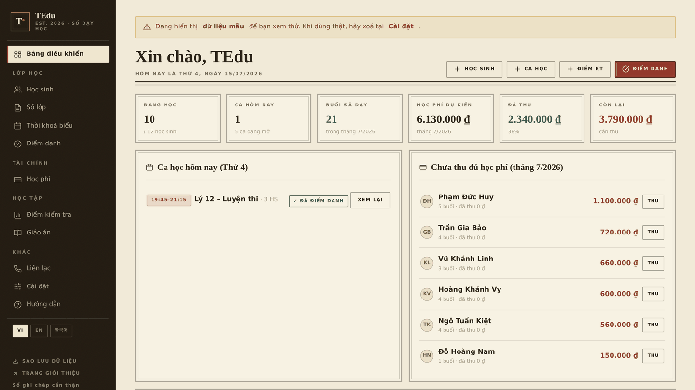 | **Students** — ledger-style list, stamp badges, quick actions<br>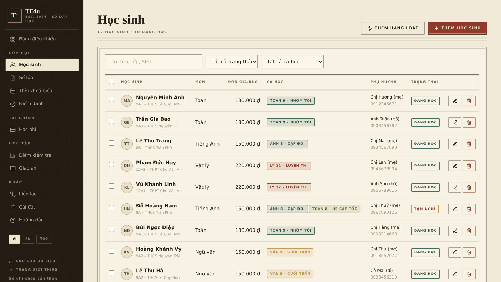 |
| **Excel-like bulk add** — paste from a spreadsheet, edit like one<br>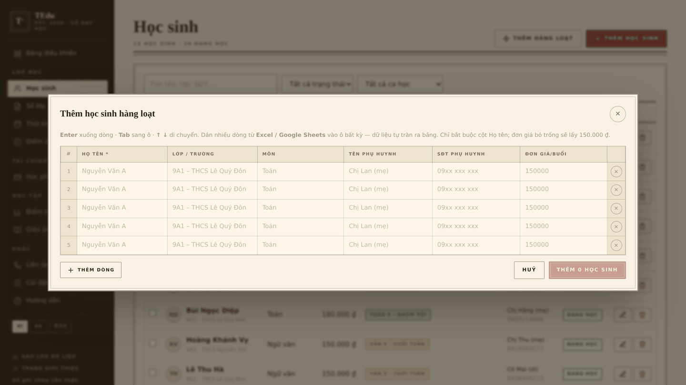 | **Class book** — per-class journal: sessions, attendance, tuition<br>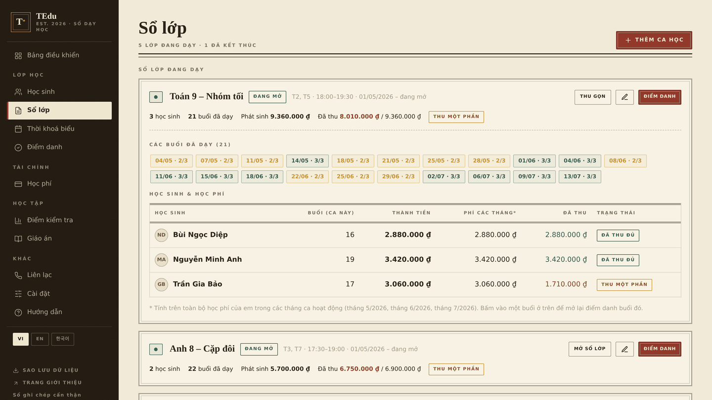 |
| **Timetable** — a real month calendar, one colour per class<br>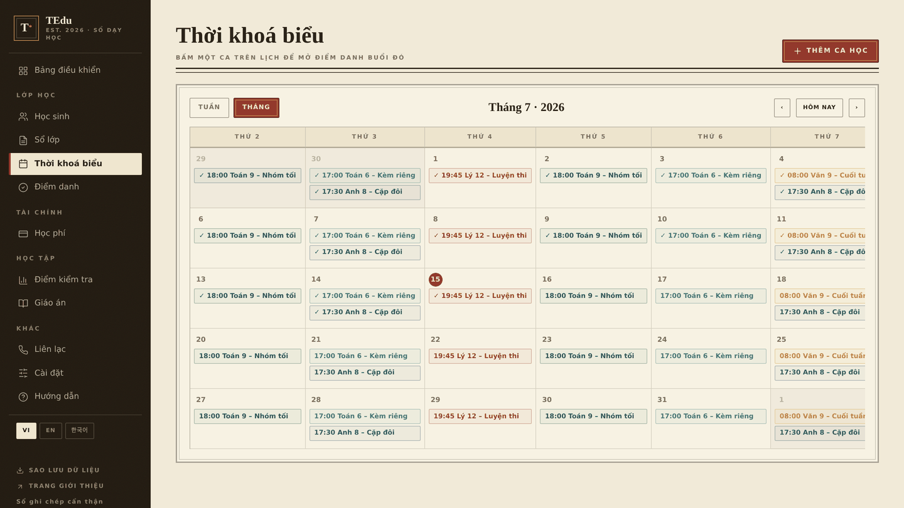 | **Attendance** — present / absent / late, notes per session<br>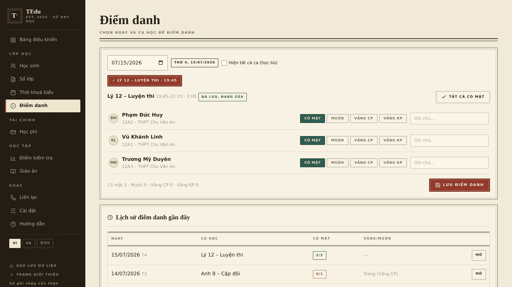 |
| **Tuition** — auto-summed per session, progress bar, quick collect<br>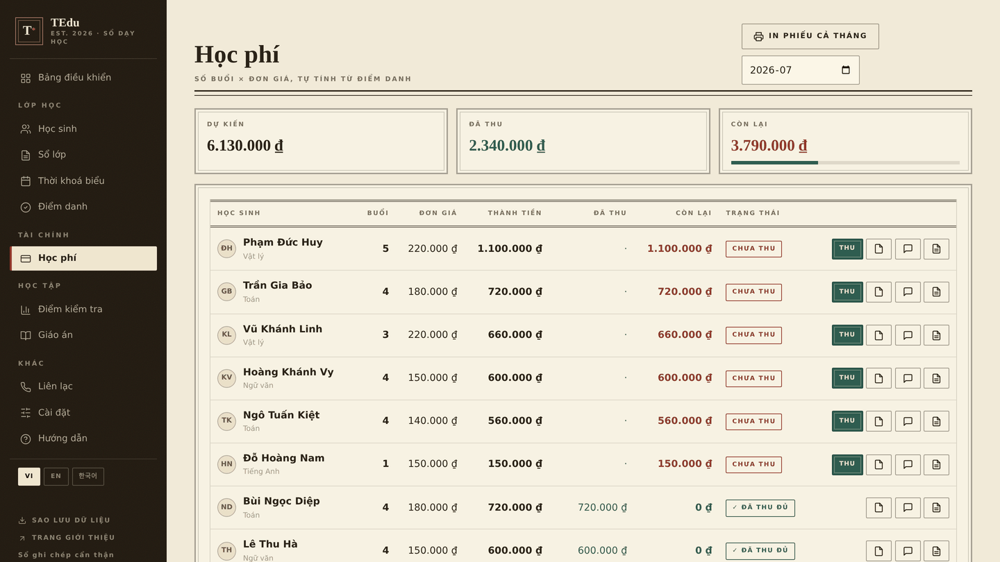 | **Vintage receipt** — "PAID IN FULL" stamp, amount in words, VietQR<br>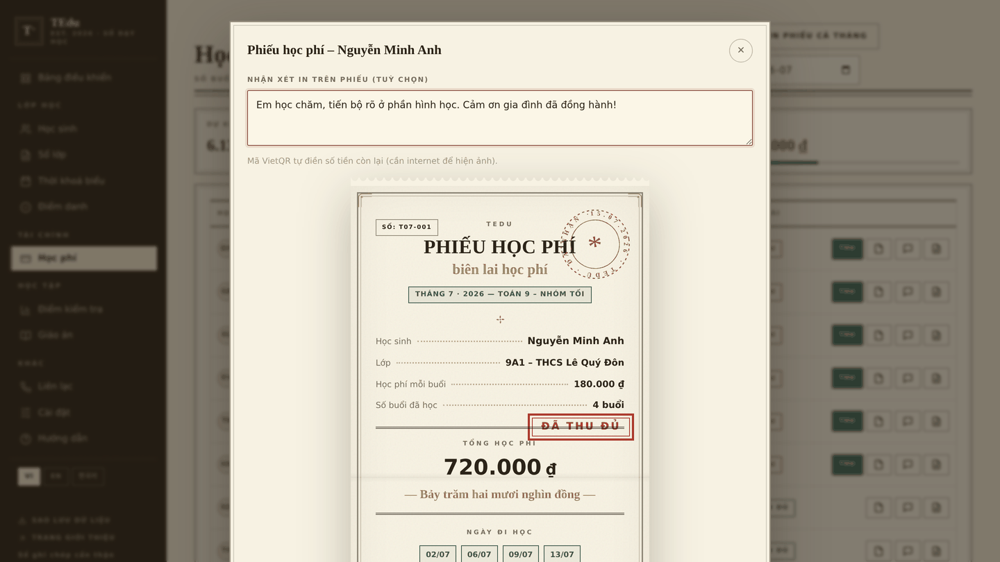 |
| **Document library** — any format, previews, pinned to lessons<br>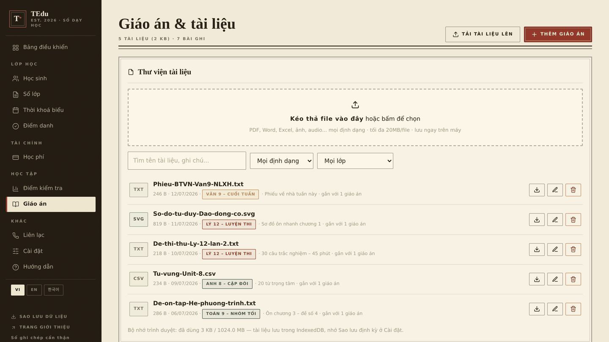 | **In-app guide** — 10+ chapters, clickable illustrations<br>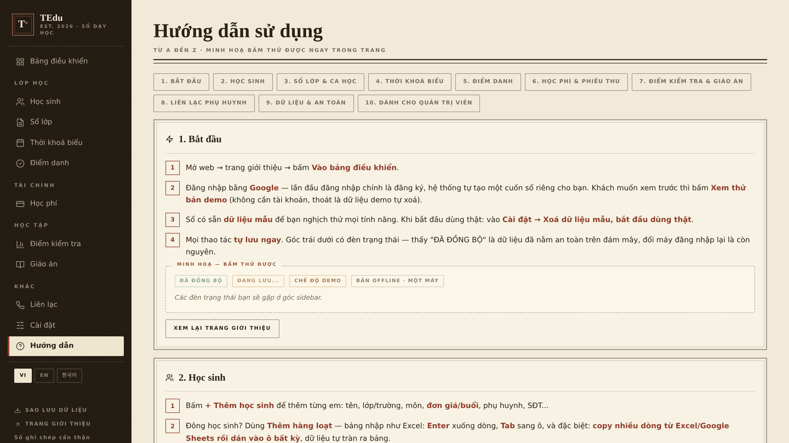 |
| **AI assistant** — plain-word commands, confirm-before-write cards<br>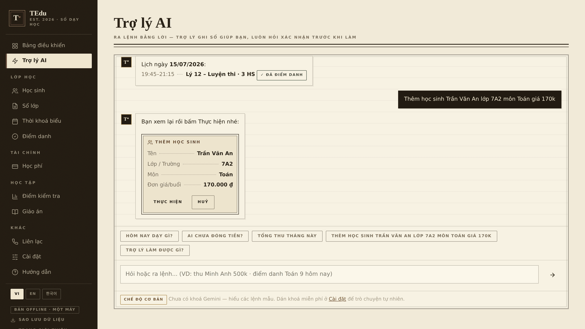 | **Sign-in screen** — Google / demo / admin gate<br> |
| **English interface** — VI/EN/KO switched instantly<br>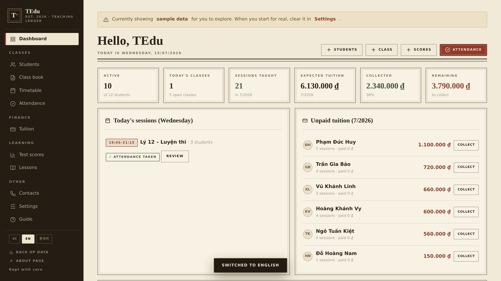 | |

## Use it in 30 seconds

1. Open **[tedu-app.netlify.app](https://tedu-app.netlify.app)**.
2. Click **"Xem thử bản demo"** (Try the demo) — you land straight in the app with 12 students, 6 classes, attendance, tuition and sample documents.
3. Like it? Go back to the sign-in screen and hit **"Sign in with Google"** — your own ledger is created instantly, empty and cloud-synced.

Or run it fully offline: download [`index.html`](index.html) and open it in a browser (the file points at the demo's Firebase — for a private offline ledger, change one line to `window.TEDU_FIREBASE_CONFIG = null;`).

## Self-host your own copy

You can stand up an independent TEdu (your own Firebase + hosting, you as admin) in **~15 minutes, 100% free**. Every step — creating the Firebase project, enabling Google Sign-In, creating Firestore, the **complete security rules**, grabbing the config, deploying to Netlify/Firebase Hosting, appointing yourself admin — is written up in:

📘 **[HUONG-DAN-TRIEN-KHAI.md](HUONG-DAN-TRIEN-KHAI.md)** *(step-by-step guide, in Vietnamese)*

The short version:

```text
1. console.firebase.google.com → Add project
2. Authentication → enable Google
3. Firestore → create DB → paste the security rules (included in the guide) → Publish
4. Project settings → create a Web app → copy firebaseConfig
5. Paste the config into index.html (the window.TEDU_FIREBASE_CONFIG = ... line)
6. Drag index.html onto app.netlify.com/drop → instant URL
7. Authentication → Authorized domains → add that domain
8. Firestore → collection `admins` → create a doc whose ID is your email (lowercase)
```

## Architecture & tech

```text
index.html  (~340 KB, everything in one file)
├── CSS      "1960s stationery shop" design system: aged paper, double-rule
│            frames, rotating postmarks, fleurons, letterpress buttons, ledger tables
├── HTML     landing page + app shell (sidebar, 13 pages, auth gate)
└── JS       vanilla JavaScript — no framework, no bundler
    ├── Data       localStorage (one key per account)
    ├── Documents  IndexedDB — binary files stay on-device, zero cloud cost
    ├── Sync       Firebase Auth (Google) + Firestore, 1.5s debounce,
    │              graceful offline fallback when config = null
    ├── i18n       VI/EN/KO dictionary + MutationObserver for dynamic UI
    ├── AI         offline Vietnamese command parser + optional Gemini API,
    │              every write gated behind a confirmation card
    └── Printing   pure-CSS receipt rendering, VietQR (img.vietqr.io)
```

- **Fonts:** Playfair Display · Be Vietnam Pro · Dancing Script (Google Fonts, full Vietnamese support).
- **Palette:** paper `#F1EAD8` · sepia ink `#2B2318` · oxblood `#93392C` · deep green `#2F5D50` · aged gold `#B08D3F` · espresso `#221B12`. Absolutely no purple 🙂.
- **No build step** — edit the file, save, reload. Updating the deployed app = drag the new file over the old one on Netlify; user data is untouched because it lives in Firestore.

## Security & data

- The Firebase `apiKey` inside `index.html` is a **public identifier by Firebase's design**, not a secret — real access control comes from **Firestore Security Rules** + **Authorized domains** (the full ruleset ships in the [deployment guide](HUONG-DAN-TRIEN-KHAI.md)).
- The rules guarantee: each teacher can **only read/write their own ledger**, and only while their account is `active`; users **cannot change their own** status/role; only admins (docs in the `admins` collection) can list accounts, block them, toggle maintenance, or broadcast announcements.
- An admin-blocked account is stopped at the server layer (no reads, no writes) — not just hidden buttons.
- Library files stay **on the user's device** (IndexedDB) and never upload. Regular JSON backups from *Settings* are recommended.
- The optional Gemini key is stored inside your own ledger and used only for your requests.

## Languages

The **VI / EN / 한국어** switcher sits in the sidebar and on the landing page. The interface translates instantly — including dynamic content (toasts, modals, tooltips). **Tuition receipts and parent messages intentionally stay Vietnamese**, since their audience is Vietnamese parents. With a Gemini key, the AI assistant replies in whichever language the UI is set to.

## License

Released under the [MIT](LICENSE) license — use, modify and share freely; just keep the copyright line.

---

<div align="center">

*Kept with care ❦ TEdu · EST. 2026*

Made with ☕ by **Tai Doan** — together with Claude

</div>
